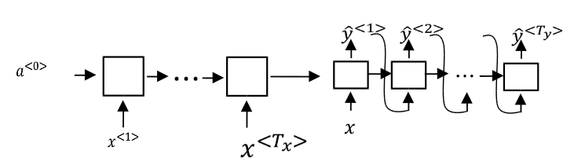

Tutorial: Multi-layered Recurrent Neural Networks (RNNs) with Long-Short Term Memory (LSTM) units which are deep both spatially and temporally.

(a) <span class="spoiler">Attention mechanism: The Convolutional Neural Network (GoogLeNet)</span> takes a video frame as its input and produces a feature cube which has features from different spatial locations. The mechanism then computes xt, the current input for the model, as a dot product of the feature cube and the location softmax lt obtained as shown in (b). Notation and further details are explained in the paper.

(b) <span class="spoiler">Recurrent model: At each time-step t, our recurrent neural network (RNN) takes a feature slice xt, generated by the attention mechanism, as the input.</span> It then propagates xt through three layers of Long Short-Term Memory (LSTM) units and predicts the next location probabilities lt+1 and the class label yt. Check out the paper for further details.

<figure>

<figcaption>Encoder Decoder model for Sequence to Sequence modeling</figcaption>
</figure>

#### So how do we do Attn nets in Python?

```python
import torch
import torch.nn as nn
from torch import optim
import torch.nn.functional as F
from torch.autograd import Variable

class Encoder(nn.Module):
  def __init__(self, input_size, hidden_size, bidirectional = True):
    super(Encoder, self).__init__()
    self.hidden_size = hidden_size
    self.input_size = input_size
    self.bidirectional = bidirectional
    
    self.lstm = nn.LSTM(input_size, hidden_size, bidirectional = bidirectional)
  
  def forward(self, inputs, hidden):
    
    output, hidden = self.lstm(inputs.view(1, 1, self.input_size), hidden)
    return output, hidden
    
  def init_hidden(self):
    return (torch.zeros(1 + int(self.bidirectional), 1, self.hidden_size),
      torch.zeros(1 + int(self.bidirectional), 1, self.hidden_size))
```
